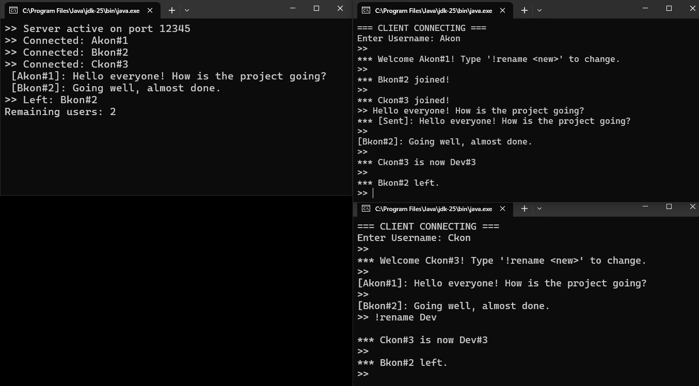

# Online Chat Application

A lightweight, multi-threaded text chat system implemented in Java. This project demonstrates a classic Client-Server architecture using Java Sockets, designed for robustness and efficiency.



## 🚀 Features

*   **Multi-Client Support:** Handles multiple concurrent users via a threaded `ExecutorService` (Server capability up to 126 active users).
*   **Real-Time Broadcasting:** Messages are instantly pushed to all connected clients.
*   **Unique Identity System:** Automatically assigns IDs (e.g., `User#1`, `User#2`) to handle duplicate usernames gracefully.
*   **Custom Protocol:** Uses a lightweight text-based protocol with specific command delimiters.
*   **Input Sanitization:** Protects the protocol integrity by stripping reserved characters.
*   **Dynamic Renaming:** Users can change their display name on the fly without disconnecting.
*   **Robust Error Handling:** gracefully manages unexpected disconnections and server shutdowns.

## 🛠️ Tech Stack

*   **Language:** Java (JDK 8+)
*   **Networking:** `java.net.Socket`, `java.net.ServerSocket`
*   **Concurrency:** `java.util.concurrent` (ExecutorService, CopyOnWriteArrayList, AtomicInteger)
*   **I/O:** `java.io` (BufferedReader, PrintWriter)

## 📋 Getting Started

### Prerequisites

*   Java Development Kit (JDK) installed on your machine.
*   Terminal or Command Prompt.

### Installation

1.  **Clone the repository:**
    ```bash
    git clone https://github.com/mwdiss/OnlineChatApplication.git
    cd OnlineChatApplication/src/
    ```

2.  **Compile the source code:**
    ```bash
    javac *.java
    ```

## 💻 Usage

To run the application, you must start the Server first, followed by one or more Clients.

### 1. Start the Server
The server listens on port `12345` by default.

```bash
java ChatServer
```
*Output:* `>> Server active on port 12345`

### 2. Start a Client
Open a new terminal window (or multiple windows for multiple users) and run:

```bash
java ChatClient
```

### 3. Client Interaction
*   **Join:** Enter your desired username when prompted.
*   **Chat:** Type a message and press Enter to send.
*   **Rename:** To change your name during a session, type:
    ```text
    !rename NewName
    ```

## 🧩 Protocol Architecture

The application uses a pipe-delimited (`|`) protocol for lightweight message framing:

| Command | Format | Description |
| :--- | :--- | :--- |
| **MSG** | `M \|Sender#ID \| Payload` | Standard chat message broadcast. |
| **SENT** | `S \| Payload` | Acknowledgment sent back to the sender. |
| **NOTIFY** | `N \| Message` | System notifications (Join, Leave, Rename). |

## 📄 License

This project is open-source and available for educational and personal use.
